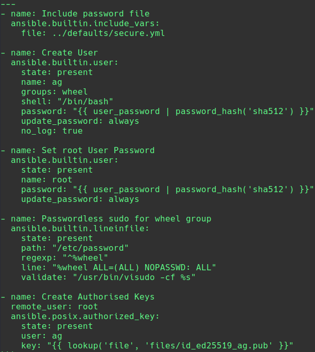

I'm setting up a RHEL Homelab in order to practice for the RHCSA. I'm using the
KVM/libvirt/qemu stack as my hypervisor. This lab environment consists of two
guest VMs running RHEL 9.3. I have enabled sshd and unlocked the root account
during installation. I plan on using ansible
for configuration management. The full ansible role is hosted on my github but
I've posted the main.yml file for the roles.

One thing of note is that I use ansible-vault to to encrypt my user password.
In the github repo, you'll see that the vault.key is on my local machine. For more information ansible-vault check the official [documentation](https://docs.ansible.com/ansible/latest/vault_guide/vault_encrypting_content.html).

See my [github repo](https://github.com/antgray/ansible-lab) for my ansible.cfg, inventory file and other roles. 

Here are the main tasks for this role:

